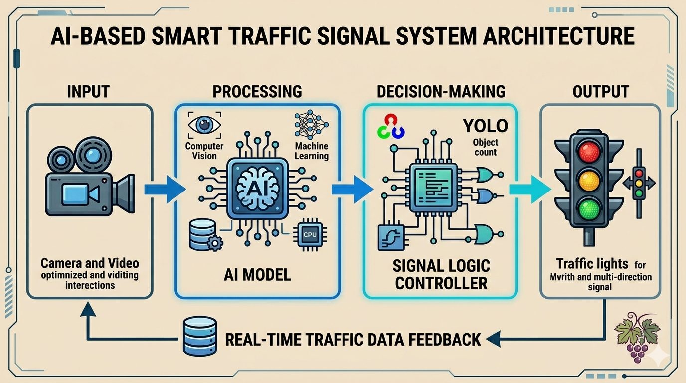

# 🚦 Smart Traffic Signal Control using AI (YOLOv5)

## 📌 Project Overview

Traffic congestion is a major issue in modern cities, leading to increased travel time, fuel consumption, and pollution. Traditional traffic signal systems operate on fixed timers, which are inefficient under dynamic traffic conditions.

This project presents a **Smart Traffic Signal Control System using Artificial Intelligence**, where signal timings are dynamically adjusted based on real-time traffic density using **YOLOv5 object detection**.

---

## 🎯 Objectives

* 🚗 Detect and count vehicles in real-time
* ⏱ Dynamically adjust traffic signal timing
* 🌱 Reduce fuel consumption and pollution
* 🚑 Improve response for emergency vehicles (future scope)
* 🏙 Contribute to smart city development

---

## 🧠 Key Features

* ✔ Real-time vehicle detection using YOLOv5
* ✔ Dynamic traffic signal timing
* ✔ Works with video input (CCTV / recorded footage)
* ✔ Displays bounding boxes and vehicle count
* ✔ Modular and scalable architecture

---

## 🏗 System Architecture

```
Video Input → YOLOv5 Detection → Vehicle Count → Decision Algorithm → Signal Timing Output
```

---

## ⚙️ Technologies Used

* 🐍 Python
* 👁 OpenCV
* 🤖 YOLOv5 (Deep Learning Model)
* 🔥 PyTorch
* 📊 NumPy

---

## 📁 Project Structure

```
smart-traffic-ai/
│
├── data/
│   └── sample_video.mp4
│
├── models/
│   └── yolov5s.pt
│
├── src/
│   ├── main.py
│   ├── detection_yolo.py
│   ├── traffic_control.py
│   └── utils.py
│
├── output/
│   └── result.mp4
│
├── images/
│   └── output.png
│
├── requirements.txt
├── README.md
└── .gitignore
```

---

## ▶️ How to Run the Project

### 🔹 Step 1: Clone Repository

```
git clone https://github.com/your-username/smart-traffic-ai.git
cd smart-traffic-ai
```

### 🔹 Step 2: Install Dependencies

```
pip install -r requirements.txt
```

### 🔹 Step 3: Run the Project

```
cd src
python main.py
```

---

## 📊 Output Description

The system processes a traffic video and produces:

* 🚗 Bounding boxes around detected vehicles
* 🔢 Real-time vehicle count
* 🚦 Dynamic signal timing displayed on screen

---

## 📸 Sample Output

<p align="center">
  
</p>

---

## 🧮 Traffic Signal Logic

| Vehicle Count | Signal Time |
| ------------- | ----------- |
| 0 – 5         | 10 sec      |
| 5 – 15        | 20 sec      |
| 15+           | 30 sec      |

---

## ⚡ Advantages

* ⏱ Reduces waiting time
* ⛽ Saves fuel
* 🌍 Eco-friendly solution
* 🤖 Fully automated system
* 📈 Scalable for large cities

---

## ⚠️ Limitations

* Requires good camera quality
* Performance affected by weather conditions
* Needs computational resources (GPU recommended)

---

## 🚀 Future Enhancements

* 🚑 Emergency vehicle detection and priority
* 🌐 Integration with IoT and smart city systems
* 📱 Mobile/web dashboard for monitoring
* 🧠 Reinforcement learning-based signal optimization
* 📍 Multi-lane traffic analysis

---

## 📚 References

* YOLOv5 Documentation
* OpenCV Documentation
* Research papers on intelligent traffic systems

---

## 👨‍💻 Author

**Your Name**
Final Year Engineering Project

---

## 📜 License

This project is licensed under the MIT License.

---

## 🙌 Acknowledgement

This project was developed as part of a final-year academic submission to demonstrate the application of AI in real-world traffic management systems.

---

